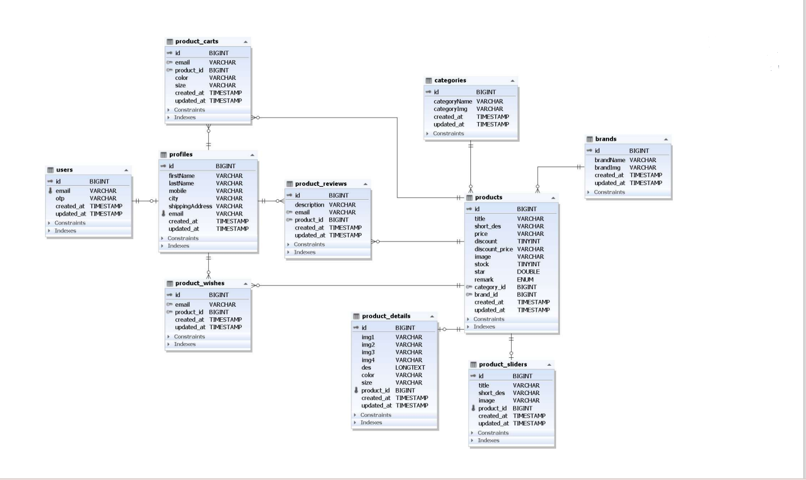

## users to profile

- usets to profile has one to one or zero relationship
  - one user can have one profile or zero profile
- profile to users has one to one (only one) relationship
  - one profile can have only one user.

## products to categories

- products to categories has only one relationship
  - one product can have only one category
- categories to products has many to zero or many relationship
  - one category can have many products or zero products

## products to brands

- products to brands has only one relationship
  - one product can have only one brand
- brands to products has many to zero or many relationship
  - one brand can have many products or zero products

## products to product_sliders

- products to product_sliders has only one or zero relationship
  - one product can have only one product_slider or zero product_slider

- product_sliders to product has only one relationship
  - one product_slider can have only one product

## products to product_details 

- same as products to product_sliders